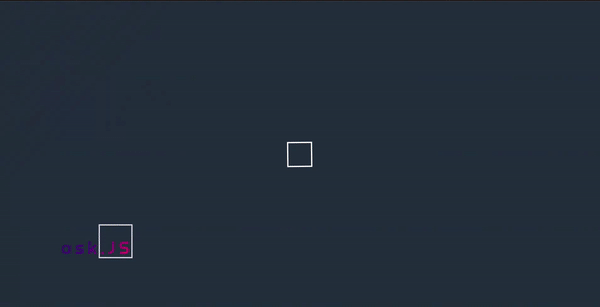
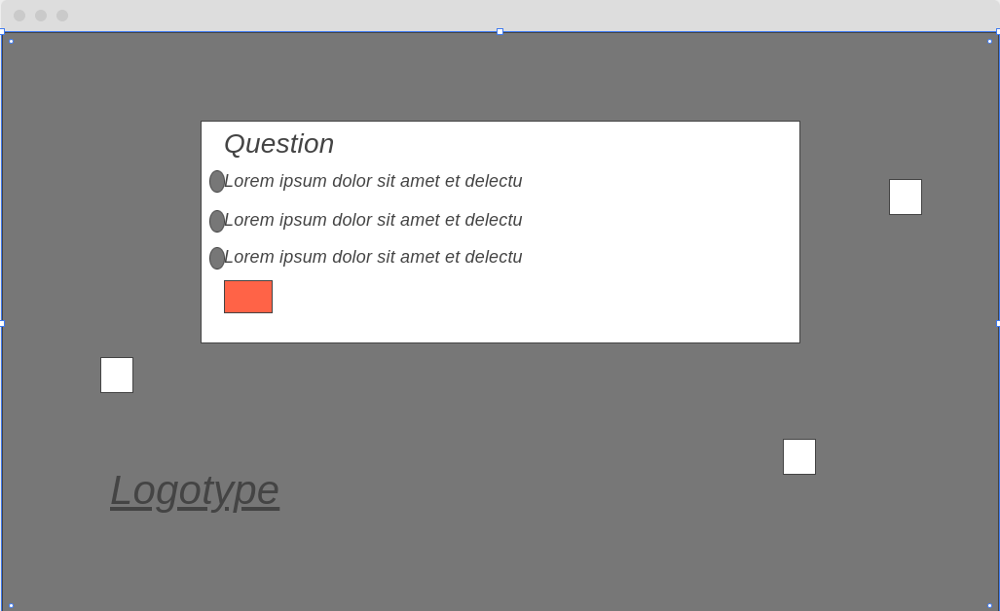

# Welcome to ask.Js

This website is designed for [ask.Js](https://github.com/DenysRudenko/Project-2/).

## Introduction
**ask.Js** is platform to train and gain knowledge in JavaScript.

'We think we are creating the system for our own purposes. We believe we are making it in our own image... But the computer is not really like us. It is a projection of a very slim part of ourselves: that portion devoted to logic, order, rule, and clarity.'

-Ellen Ullman, Close to the Machine: Technophilia and its Discontents

## Table of Contents 

# Table of Contents
- [1. Who will be interested in visiting the website?](#interested)
    - [User experience:](#user-exp)
    - [User Goals:](#user-goals)
    - [User Expectations:](#user-expectations)
    -	[Colour scheme](#color-scheme)
    - [Animation](#animation)
    - [Site skeleton (wireframes)](#wireframes)
    - [Introduction page](#introduction-page)
    - [Result](#result)
- [2. Features](#features)
- [3.Technologies used](#technologies-used)
- [4.Testing](#testing)
- [5.Bugs](#bugs)
- [6. GitHub](#git)
- [7. Information](#acknowledgement)
- [8. Future](#future)

  

# 1. Who will be interested in visiting the website?
  [Go to the top](#table-of-contents)
* users who wants to check their knowledge of JavaScript 
* people who looking for interview of JavaScript developing 
* people who want to learn more about the JavaScript 

## 1.1 User experience 
   [Go to the top](#table-of-contents)

In the modern world there is a lot of educational books and resources for a knowledge. This website can help with learning the JavaScript. There is 3 pages on the website which include 'Instruction','Questions','Result'. The user have ability to start all over again by pressing the buttons.

## 1.2 User Goals
  [Go to the top](#table-of-contents)

My main goal during the project was creation of the basic questions about JavaScript. There is lot of more questions will be added in the future.

## 1.3 User Expectations
   [Go to the top](#table-of-contents)

The website contains information about functions,switch construction,arrays,variables. Why we neeed version control system GIT?
* all pages are easily accessible 
* the interface is easily navigated 
* responsive design for all screen/device sizes

## 1.4 Color Scheme
  [Go to the top](#table-of-contents)

The choice of the color scheme for the website i took from 'Instagram' posts.

## 1.5 Animation
  [Go to the top](#table-of-contents)

I decided to create nicely animation on the background, so the user dont feel so bored while answering the questions. I looked up for animation in google and found a list of them [here](https://alvarotrigo.com/blog/animated-backgrounds-css/).

What did i do?
* Created a background animation(Thank`s google for good examples)
* Created a loading animation.
* The boxes with questions is animated.
* The logo is animated.

## 1.6 Site Skeleton
  [Go to the top](#table-of-contents)

[Wireframe](https://wireframe.cc/) was used to create wireframes of the website. This was very useful as you can quickly make an example of your website.

## Introduction Page

### Desktop
   [Go to the top](#table-of-contents)

* Animation logo

* First page

* Second page

* Third page

## Result

### Desktop

* Animation

* 1st page

* 2nd page

* 3rd page

### Mobile

* Animation

* 1st page

* 2nd page

* 3rd page

  
# 2. Features
  [Go to the top](#table-of-contents)
 ### All 4 pages:

#### Header contains:
* Logo
* Social links
* Menu button

#### Social links:  
Social media links (for Facebook, Instagram and WhatsUp) are placed at the top and the bottom of each page in the header and footer. All the links open in a new tab. In mobile version the top social links are disabled by using:
* display: none;

I decided to place them there, because I was trying to make a similar design as [here](https://dribbble.com/shots/11360956--84-2-Shots-for-Practice/attachments/2973440?mode=media).

Back to home link provided at each page at the top left corner. This allows the user to access the home page in one click.

#### Navigation bar: 
Placed at the top right corner in the menu button. I read a lot of material to develop it, taken from one of the examples [here](https://freefrontend.com/css-hamburger-menu-icons/). The style of code was changed and edited for my purposes. There was a lot of work making that without JavaScript.

#### Languages:
Website contain 2 different languages:
* English
* Ukrainian

#### Drop down menu bar: 
Slided from the left side and contains :
* Home
* Gallery
* About us
* Contact us

#### Logo:
Tattoo Studio is placed on the top left corner and has an active selector which changes the color.

#### Background color:
Background color of the header is transparent.
### Home page:
- Artist image is included right below the menu bar to highlight that this website provides a tattoo sketches. 
- The page contains 3 blocks of information : "Tattoo Studio in Kyiv", "Garanties", "Feedback".
 Each block contains information about it and image/video provided.
- An external link "SCHEDULE AN APPOINTMENT" provided, so interested users can apply for a tattoo session. The link has a hover effect.

### Gallery page:
- Gallery image right below the menu bar.
- Page contains one block with 8 photos of tattoos.

### About us page:
- Gallery image just below the menu bar.
- Page contains two blocks of information.
- 1st block of information is about the artist "Alexandr Simakov"
- 2nd block of information is about "Instruments and materials"

### Contact us page:
- Page contains one block with 2 different sections.
- 1st section is a form, where the user can add his information about them and apply for a session.
- 2nd section is location information with map, address and contact details.
- If user wants to send an email they can press a link with an email.Look at the photo bellow:

* Unfortunately the map details I hide at mobile version due to lack of time to style and finish the project till 30th of June.

- The form use the method="POST" action="https://formdump.codeinstitute.net/"

I made a "WhatsUp" link at the top and at the bottom page to help users to contact the artist of the studio the fastest way. If a user clicks on that link, they immediately are redirect to "WhatsUp" chat.

Look at the pictures below:

"Open xdg-open" this means that google chrome asking you a permission
to open an application on Ubuntu/Debian operating systems.

# 3. Technologies Used
  [Go to the top](#table-of-contents)

* [HTML5](https://en.wikipedia.org/wiki/HTML5) (markup language) was used for structuring and presenting content of the website.

* [CSS3](https://en.wikipedia.org/wiki/CSS) (Cascading Style Sheets) was used to provide the style to the content written in a HTML.

* [Wireframe](https://wireframe.cc/) was used to create wireframes of the website.

* [Google Fonts](https://fonts.google.com/) was used to import font-family 'Krona One' into style,css file and which was used throughout the pages of the website.

* [Adobe Photoshop](https://www.adobe.com/uk/products/photoshop.html) was used to resize some of the site images and style them.

* [Font Awesome](https://fontawesome.com/) was used to import icons to the sites.

* [Chrome](https://www.google.com/intl/en_uk/chrome/) was used to debug and test the source code using HTML5 as well as to test site responsiveness.

* [Github](https://github.com/) was used to create the repository and to store the project's code after pushed from Git.

* [Visual Studio](https://code.visualstudio.com/) was used as code generator. I installed ssh for comfortable work.

* Extensions for visual studio, see the photo below:

# 4. Testing
  [Go to the top](#table-of-contents)

## 4.1 Testing using tools

### 4.1.1 Google Developer Tools
I make use of google developer tools (Chrome DevTools). 

### 4.1.2 Responsive Tools

In order to make sure that design web pages are responsive, [Am I Responsive](http://ami.responsivedesign.is/) page was used to check it. 
Also checked with a mobile phone Huawei p40 lite.

### 4.1.3 W3C Validator Tools

[W3C Markup](https://validator.w3.org/#validate_by_input+with_options) was used to check for any errors with my HTML pages.

See the pictures below:

The HTML checker showed a perfect result.

[W3C CSS Validation](https://jigsaw.w3.org/css-validator/) was used to check for any error within my css file. I have a couple of errors with setting a properties for margin in - 15px, and setting a font-weight with a property with px.I have a few warnings in css file though.

See the pictures below:

### 4.1.4 Js Hint validator

## 4.2 Tests

My problem with the whole project was that all images were a big size. For that reason whole pages take a while to load. All depends on the user's internet speed. So the percentage of performance is highly variable.
To solve that problem read the "Future".

See the picture below:

# 5. Bugs
 [Go to the top](#table-of-contents)

  ### Solved bugs
- I had a few problems with a path to images.
- I had a bug with a setTiomeOut function in js file with a timer, the start animation didnt work properly. Fixed with playing with diferent timer options.
 
See the gif bellow:

I decided to make a fixed qube around Js, there is a lot a qubes already hanging around the page.

 
# 6. GitHub
  [Go to the top](#table-of-contents)

The web was deployed to GitHub pages:
- Sharing of mine profile here - https://github.com/DenysRudenko
- The live link can be found here - (https://github.com/DenysRudenko/Project-2)

  
# 7. Information
 [Go to the top](#table-of-contents)
### Code
* The documentation for animation at the start of the page readed from here https://stackabuse.com/loading-animation-in-vanilla-javascript/
* The code for timeout function for animated qube from here https://coderwall.com/p/_ppzrw/be-careful-with-settimeout-in-loops
* The design idea for logo i took from this page https://alvarotrigo.com/blog/css-text-animations/
* The design idea for pages was taken from https://www.goodkindtattoo.com/
* For README.md file, reference of https://github.com/DenysRudenko/Project-1 and https://github.com/josswe26/rpsls
* A big thank you to mentor Marcel Mulders for tips and for supporting a project I made.
* The quiz idea and some examples of code came from wathing that video https://www.youtube.com/watch?v=riDzcEQbX6k&ab_channel=WebDevSimplified

# 8. Future
[Go to the top](#table-of-contents)

### Questions
* Increase amount of question with examples of code.

### Timer
* Develop a timer for every question.

### Achievements
* Develop achievements for asnwering correct.

### Clues
* Develop a clues with a link with documentation.

### Profile
* Develop the personal profile page with a percentage of succes.

